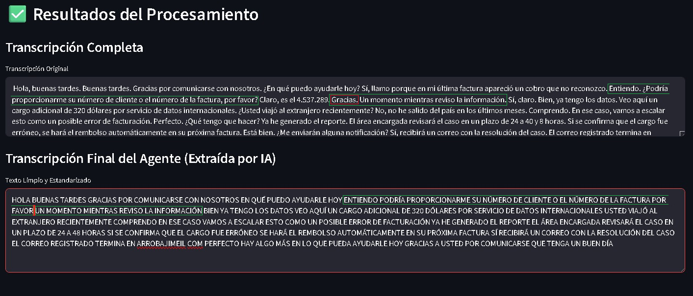
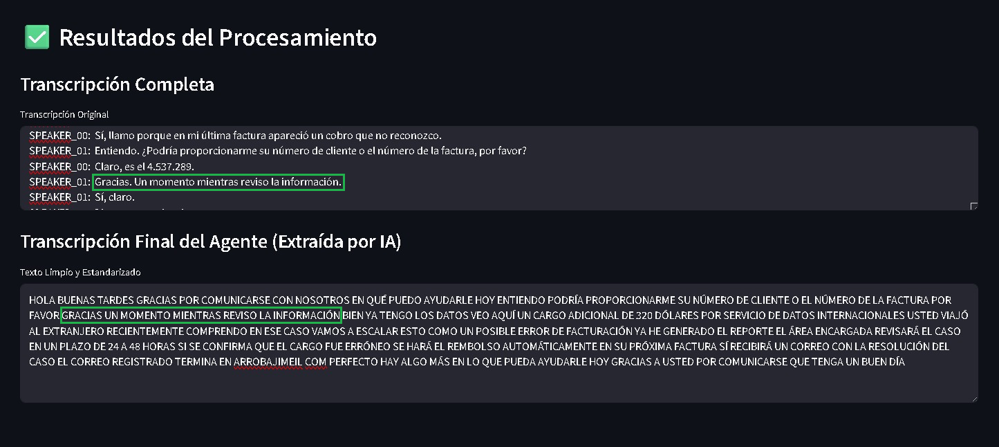

# 🤖 Procesamiento y Transcripción de Llamadas de Call Center

> Sistema de procesamiento de audio y transcripción inteligente para llamadas de agentes de call center, desarrollado en Python con procesamiento local y análisis de IA.

## 📋 Descripción del Proyecto

Este proyecto implementa una solución completa para el procesamiento y análisis de llamadas de call center, cumpliendo con los siguientes requerimientos:

- **Transcripción local** utilizando Whisper (local)
- **Preprocesamiento de audio** con filtros y limpieza
- **Identificación automática** del diálogo del agente mediante LLM
- **Limpieza y estandarización** del texto resultante

### 🎯 Características Principales

✅ **Procesamiento Local Completo**: Transcripción y análisis sin dependencias de servicios externos (excepto OpenAI para extracción de agente)

✅ **Preprocesamiento Avanzado**: Conversión a mono, normalización, filtros de ruido y eliminación de silencios

✅ **Diarización Opcional**: Soporte para identificación de hablantes usando pyannote-whisper

✅ **Interfaz Web Intuitiva**: Aplicación Streamlit con diseño responsive y feedback en tiempo real

✅ **Manejo Robusto de Errores**: Validaciones y recuperación ante fallos en el procesamiento

## 🚀 Instalación y Configuración

### Prerequisitos del Sistema

- **Python 3.10+**
- **FFmpeg** instalado y configurado en el PATH del sistema

#### Instalación de FFmpeg

| Sistema Operativo | Comando |
|-------------------|---------|
| Windows (Chocolatey) | `choco install ffmpeg` |
| macOS (Homebrew) | `brew install ffmpeg` |
| Ubuntu/Debian | `sudo apt-get install ffmpeg` |
| CentOS/RHEL | `sudo yum install ffmpeg` |

### Configuración del Entorno

1. **Clonar el repositorio**
```bash
git clone https://github.com/carriazoe12/agent-voice2text.git
cd agent-voice2text
```

2. **Crear entorno virtual**
```bash
python -m venv venv
```

3. **Activar entorno virtual**
```bash
# Windows
venv\Scripts\activate

# macOS/Linux
source venv/bin/activate
```

4. **Instalar dependencias**
```bash
pip install -r requirements.txt
```

### Configuración de Tokens (Opcional)

Para utilizar la funcionalidad de diarización de hablantes, necesitarás configurar un token de Hugging Face:

1. **Crear cuenta en [Hugging Face](https://huggingface.co)**
2. **Obtener acceso al modelo de diarización:**
   - Visita [pyannote/segmentation](https://huggingface.co/pyannote/segmentation)
   - Haz clic en "Accept" para aceptar los términos de uso
   - Esto es necesario para acceder a los modelos de diarización
3. **Generar token de acceso:**
   - Ve a [Settings → Access Tokens](https://huggingface.co/settings/tokens)
   - Crea un nuevo token con permisos de lectura
4. **Configurar en el proyecto:**
   - Crear archivo `.env` en la raíz del proyecto:
```env
HUGGINGFACE_TOKEN=hf_XXXXXXXXXXXXXXXXXXXXXXXX
```

## 🎮 Uso de la Aplicación

### Ejecución Básica

```bash
streamlit run main.py
```

La aplicación estará disponible en `http://localhost:8501`

### Flujo de Trabajo

1. **Configuración Inicial**
   - Ingresa tu OpenAI API Key en la barra lateral
   - (Opcional) Configura el token de Hugging Face para diarización

2. **Carga de Audio**
   - Sube un archivo de audio (`.wav`, `.mp3`, `.m4a`)
   - El sistema validará el formato y mostrará una vista previa

3. **Procesamiento**
   - Haz clic en "Procesar con IA"
   - El sistema ejecutará el pipeline completo:
     - Preprocesamiento de audio
     - Transcripción con Whisper
     - Extracción del diálogo del agente
     - Limpieza y estandarización

4. **Resultados**
   - Revisa la transcripción completa
   - Descarga el texto final del agente
   - Los archivos se guardan automáticamente en las carpetas correspondientes

### 🔄 Cambiar entre Modos de Transcripción

El sistema viene configurado por defecto en **modo básico** (Whisper). Para activar el **modo con diarización**, debes modificar el archivo `main.py`:

**En el archivo `main.py`, líneas 76-80:**

```python
st.write("2️⃣ **Transcribiendo la conversación completa (Agente y Cliente)...**")
transcripcion_completa = transcribir_audio(audio_preprocesado_path)
# Alternativa con diarización local (Whisper + pyannote): 
#transcripcion_completa = transcribir_audio_diarizado(audio_preprocesado_path)   
```

**Para activar la diarización:**
1. Comenta la línea 77: `# transcripcion_completa = transcribir_audio(audio_preprocesado_path)`
2. Descomenta la línea 79: `transcripcion_completa = transcribir_audio_diarizado(audio_preprocesado_path)`

**Resultado final:**
```python
st.write("2️⃣ **Transcribiendo la conversación completa (Agente y Cliente)...**")
# transcripcion_completa = transcribir_audio(audio_preprocesado_path)
# Alternativa con diarización local (Whisper + pyannote): 
transcripcion_completa = transcribir_audio_diarizado(audio_preprocesado_path)   
```

> **Nota**: Asegúrate de tener configurado el token de Hugging Face en el archivo `.env` antes de usar el modo con diarización.

## 📁 Estructura del Proyecto

```
Indratask/
├── main.py                          # Aplicación principal Streamlit
├── requirements.txt                 # Dependencias del proyecto
├── README.md                        # Documentación
├── .env                            # Variables de entorno (opcional)
├── audio_in/                       # Archivos de audio de entrada
├── audio_out/                      # Audio preprocesado
├── transcripciones/                # Transcripciones finales
├── venv/                           # Entorno virtual
└── utils/                          # Módulos de utilidades
    ├── __init__.py
    ├── preprocesar_audio.py        # Preprocesamiento de audio
    ├── transcribir_audio.py        # Transcripción con Whisper
    ├── transcribir_audio_diarizado.py  # Transcripción con diarización
    ├── analisis_llm.py             # Análisis con OpenAI
    └── limpiar_texto.py            # Limpieza de texto
```

## 🔧 Funcionalidades Técnicas

### Preprocesamiento de Audio

El sistema implementa un pipeline robusto de preprocesamiento:

- **Conversión a Mono**: Unificación de canales para mejor compatibilidad
- **Normalización**: Ajuste automático de niveles de volumen
- **Filtros de Ruido**: Eliminación de frecuencias problemáticas (100Hz - 8kHz)
- **Eliminación de Silencios**: Corte automático de pausas prolongadas

### Transcripción Inteligente

El sistema ofrece dos enfoques para la transcripción, cada uno con sus ventajas:

#### **Modo Básico (Whisper)**
- Transcripción local completa de la conversación
- Optimización de memoria con carga única del modelo
- Soporte para múltiples idiomas
- Procesamiento más rápido
- Requiere análisis posterior con LLM para identificar al agente

#### **Modo Avanzado (Diarización)**
- Identificación automática de hablantes (SPEAKER_00, SPEAKER_01, etc.)
- Combinación de Whisper + pyannote.audio
- Mayor precisión en la identificación del agente
- Mejor separación entre agente y cliente

### 🔍 Comparación de Modos: Básico vs Diarización

#### **Ejemplo de Mejora en Precisión**

**Modo Básico - Error detectado:**

*El modo básico cometió un error de 1 palabra en la transcripción*

**Modo Diarización - Mejor precisión:**

*El modo con diarización corrigió el error y mejoró la precisión general*

> **Nota**: La diarización requiere un token de Hugging Face para descargar los modelos de identificación de hablantes, pero la inferencia se realiza completamente de forma local.

### Análisis con LLM

El sistema utiliza OpenAI GPT para:
- Identificar y extraer únicamente el diálogo del agente
- Mantener contexto y coherencia del discurso
- Adaptarse a diferentes estilos de comunicación

### Limpieza de Texto

Proceso de estandarización que incluye:
- Conversión a mayúsculas
- Eliminación de signos de puntuación
- Preservación de caracteres especiales del español (á, é, í, ó, ú, ñ)
- Normalización de espacios

## 📊 Ejemplo de Entrada y Salida

### Archivo de Entrada
```
audio_in/llamada_ejemplo_1.wav
```

### Salida Procesada

**Transcripción Completa (Modo Básico - Whisper):**
```
Buenos días, le atiende María del servicio al cliente. ¿En qué puedo ayudarle?
Hola, tengo un problema con mi factura...
Entiendo, permítame verificar su información...
```

**Transcripción Completa (Modo Diarización - Whisper + pyannote):**
```
SPEAKER_00: Buenos días, le atiende María del servicio al cliente. ¿En qué puedo ayudarle?
SPEAKER_01: Hola, tengo un problema con mi factura...
SPEAKER_00: Entiendo, permítame verificar su información...
```

**Texto Final del Agente (Limpio):**
```
BUENOS DIAS LE ATIENDE MARIA DEL SERVICIO AL CLIENTE EN QUE PUEDO AYUDARLE
ENTIENDO PERMITAME VERIFICAR SU INFORMACION
```

### Archivos Generados

- `audio_out/llamada_ejemplo_1_preprocesado.wav` - Audio limpio
- `transcripciones/llamada_ejemplo_1_agente.txt` - Texto final del agente

## 🛠️ Solución de Problemas

### Errores Comunes

| Error | Solución |
|-------|----------|
| `FFmpeg not found` | Instalar FFmpeg y agregar al PATH del sistema |
| `NumPy version conflict` | Usar `numpy==1.26.4` como especificado en requirements.txt |
| `OpenAI API error` | Verificar que la API Key sea válida y tenga créditos |
| `Hugging Face token error` | Crear token en huggingface.co y configurar en .env |

### Optimización de Rendimiento

- **Para audios largos**: Considerar usar el modelo Whisper "small" o "medium"
- **Para mejor precisión**: Activar la diarización con token de Hugging Face
- **Para procesamiento rápido**: Usar GPU si está disponible (PyTorch CUDA)

## 🔗 Enlaces Útiles

- [Documentación de Whisper](https://github.com/openai/whisper)
- [pyannote-whisper](https://github.com/yinruiqing/pyannote-whisper)
- [pyannote/segmentation](https://huggingface.co/pyannote/segmentation) - Modelo de diarización
- [Documentación de Streamlit](https://docs.streamlit.io/)
- [FFmpeg](https://ffmpeg.org/)

## 👨‍💻 Autor

**Eduardo Ahumada Carriazo**

---


